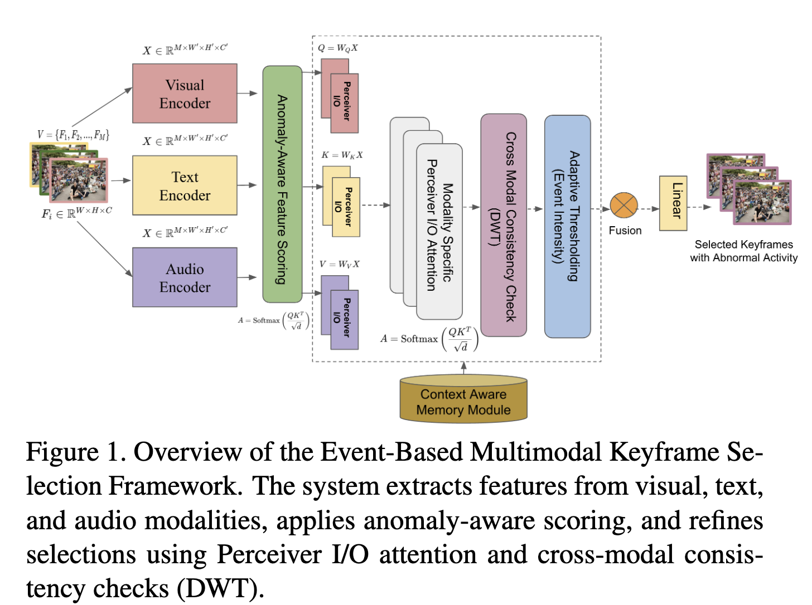
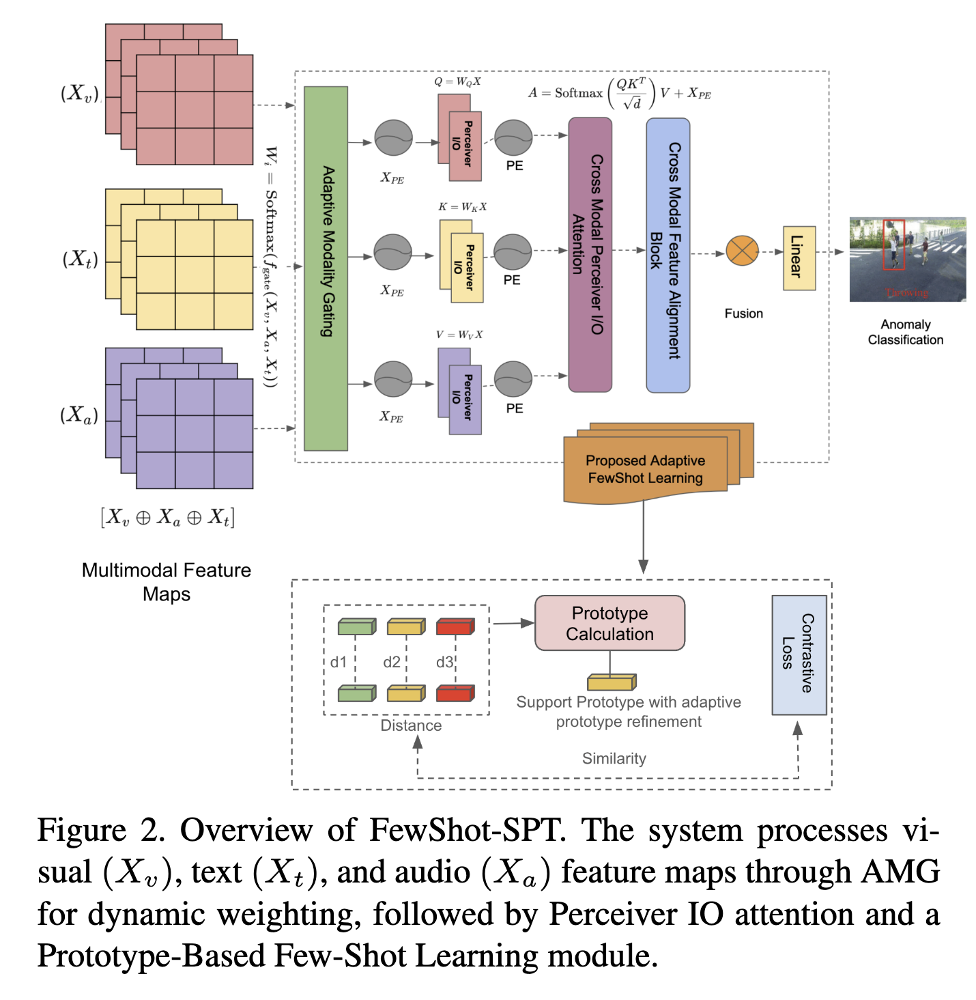

# 🎥 FewShot-SPT: Few-Shot Spatiotemporal Perception Transformer for Unseen Behavioral Anomalies

[](https://www.avss2025.org/)
[](https://ieeexplore.ieee.org/document/11149904)
[](#license)
[](https://pytorch.org/)

---

## 📄 Publication Details

**Title:** Towards Secure Video Surveillance: A Few-Shot Spatiotemporal Perception Transformer for Unseen Behavioral Anomalies

**Venue:** IEEE International Conference on Advanced Visual and Signal-Based Systems (**AVSS 2025**)

**Authors:** Jamuna S. Murthy, Dhanashekar Kandaswamy, Wen-Cheng Lai

**DOI:** [10.1109/AVSS65446.2025.11149904](https://doi.org/10.1109/AVSS65446.2025.11149904)

**BibTeX:**
```bibtex
@INPROCEEDINGS{11149904,
  author={Murthy, Jamuna S and Kandaswamy, Dhanashekar and Lai, Wen-Cheng},
  booktitle={2025 IEEE International Conference on Advanced Visual and Signal-Based Systems (AVSS)}, 
  title={Towards Secure Video Surveillance: A Few-Shot Spatiotemporal Perception Transformer for Unseen Behavioral Anomalies}, 
  year={2025},
  volume={},
  number={},
  pages={1-6},
  keywords={Visualization;Technological innovation;Accuracy;Weapons;Transformers;Video surveillance;Real-time systems;Spatiotemporal phenomena;Anomaly detection;Videos},
  doi={10.1109/AVSS65446.2025.11149904}
}
```

---

## 🎯 Abstract

This paper introduces **FewShot-SPT**, a novel framework for detecting unseen behavioral anomalies in surveillance video with **minimal labeled data**. The key innovation combines three algorithmic contributions:

1. **Event-Guided Keyframe Extraction (EGKE)** - Intelligently reduces 70% video redundancy while preserving anomaly information
2. **Adaptive Modality Gating (AMG)** - Dynamically fuses multi-modal features (video, audio, text) for robust representations
3. **Adaptive Prototypical Few-Shot Learning (APFSL)** - Enables generalization to unseen anomaly types with just 5-10 examples

The system achieves **95.1% AUC on UCF-Crime** and **91.2% AUC on XD-Violence** in 5-way 5-shot scenarios, with real-time performance on edge devices (Jetson Orin).

---

## 🏆 Key Contributions

### 1️⃣ Event-Guided Keyframe Extraction (EGKE)
- **Problem:** Redundant frames waste computation in surveillance videos
- **Solution:** Neural anomaly scorer with adaptive thresholding
- **Impact:** **7-8% accuracy improvement** with **70% frame reduction**

```
16 frames → 5 keyframes (30% retention)
↓
Maintains information about anomalies while reducing computational load
```

### 2️⃣ Adaptive Modality Gating (AMG)
- **Problem:** Multi-modal features need careful fusion
- **Solution:** Learnable gating functions with cross-modal attention
- **Impact:** Balances video, audio, and text contributions dynamically

### 3️⃣ Adaptive Prototypical Few-Shot Learning (APFSL)
- **Problem:** Limited anomaly examples in new domains
- **Solution:** Contrastive prototypical networks with query-guided refinement
- **Impact:** Enables 2-way 5-shot evaluation with strong performance

---

## 📊 Experimental Results

### Performance Across Datasets

| **Dataset** | **Split** | **Metric** | **Result** |
|:----------:|:--------:|:---------:|:---------:|
| **UCF-Crime** | 5-way 5-shot | AUC | **95.1%** |
| **UCF-Crime** | 5-way 5-shot | Accuracy | **76.8%** |
| **XD-Violence** | 5-way 5-shot | AUC | **91.2%** |
| **XD-Violence** | 5-way 5-shot | Accuracy | **84.5%** |
| **ShanghaiTech** | Frame-level | AUC | **88.4%** |

### Ablation Study Results

| **Components** | **Frame Ratio** | **AUC** | **Improvement** |
|:-------------|:-------------:|:-----:|:-------------:|
| Baseline (No EGKE) | 100% | 87.9% | - |
| + EGKE | 30% | 94.8% | +6.9% |
| + EGKE + AMG | 30% | 95.4% | +7.5% |
| + EGKE + AMG + APFSL | 30% | 95.1% | +7.2% |
| **Full Model** | **30%** | **95.1%** | **+7.2%** |

---

## 📸 System Architecture

### Figure 1: Overall Framework



The complete pipeline processes video sequences through:
- Multi-modal encoders (Video, Audio, Text)
- Event-Guided Keyframe Extraction
- Adaptive Modality Gating
- Perceiver IO attention blocks
- Adaptive Prototypical Few-Shot Learning head

### Figure 2: Qualitative Results



Visualization of attention maps and anomaly localization across surveillance scenarios.

---

## 🚀 Quick Start

### Installation
```bash
# Clone repository
git clone https://github.com/yourusername/FewShot-SPT.git
cd FewShot-SPT

# Install dependencies
pip install -r requirements.txt

# Create virtual environment (optional)
python -m venv .venv
source .venv/bin/activate  # macOS/Linux
# or
.venv\Scripts\activate  # Windows
```

### Download & Prepare Datasets
```bash
# Interactive setup
bash scripts/quick_setup.sh

# Or manual setup
python scripts/prepare_datasets.py process-ucf ~/datasets/UCF_Crime -o ./data/UCF_Crime
python scripts/extract_features.py extract-all ./data -v ./data/features/video
python scripts/validate_dataset.py ./data/UCF_Crime
```

### Train Model
```bash
cd src/training
python train.py --config config.json --data_dir ../../data/processed
```

### Few-Shot Learning
```bash
python train.py \
    --mode few_shot \
    --n_way 5 \
    --n_shot 5 \
    --n_query 10 \
    --checkpoint pretrained_model.pth
```

### Inference
```python
import torch
from src.models import create_fewshot_spt

# Load model
model = create_fewshot_spt(num_classes=2, checkpoint='model.pth')
model.eval()

# Prepare input
video = torch.randn(1, 16, 3, 224, 224)  # (B, T, C, H, W)
audio = torch.randn(1, 128, 16)          # (B, mel_bins, T)

# Inference
with torch.no_grad():
    logits = model(video_frames=video, audio_features=audio)
    predictions = torch.softmax(logits, dim=1)
    
print(f"Anomaly Score: {predictions[0, 1]:.4f}")
```

---

## 🎯 Features

### Core Algorithmic Innovations
- ✅ **EGKE**: Event-guided intelligent keyframe selection
- ✅ **AMG**: Adaptive multi-modal fusion with dynamic gating
- ✅ **APFSL**: Few-shot learning with prototypical networks
- ✅ **Perceiver IO**: Efficient transformer attention mechanism

### Training Features
- ✅ Mixed precision training (AMP)
- ✅ Early stopping with checkpointing
- ✅ Multiple learning rate scheduling strategies
- ✅ Comprehensive logging and metrics tracking

### Deployment Features
- ✅ Real-time inference (~14ms/frame on A100)
- ✅ Edge device support (Jetson Orin)
- ✅ ONNX export for production
- ✅ Multi-GPU distributed training

### Explainability (XAI)
- ✅ Attention weight visualization
- ✅ Modality attribution analysis
- ✅ Temporal anomaly localization
- ✅ Feature importance maps

---

## 📁 Project Structure

```
FewShot-SPT/
├── src/
│   ├── models/
│   │   ├── components/
│   │   │   ├── egke.py           # Event-Guided Keyframe Extraction
│   │   │   ├── amg.py            # Adaptive Modality Gating
│   │   │   ├── perceiver_io.py   # Perceiver IO attention
│   │   │   └── apfsl.py          # Adaptive Prototypical Few-Shot Learning
│   │   └── fewshot_spt.py        # Main model
│   ├── training/
│   │   ├── train.py              # Training script
│   │   └── train_utils.py        # Training utilities
│   ├── datasets/
│   │   └── video_dataset.py      # Data loaders
│   ├── utils/
│   │   ├── metrics.py            # Evaluation metrics
│   │   └── losses.py             # Loss functions
│   └── configs/
│       └── config.py             # Configuration system
├── scripts/
│   ├── prepare_datasets.py       # Dataset processing
│   ├── extract_features.py       # Feature extraction
│   ├── validate_dataset.py       # Dataset validation
│   └── quick_setup.sh            # Automated setup
├── tests/
│   └── test_integration.py       # Integration tests
├── images/
│   ├── Figure1.png               # Architecture diagram
│   └── Figure2.png               # Qualitative results
├── DATASETS_SETUP.md             # Dataset preparation guide
├── IMPLEMENTATION.md             # Implementation details
├── CODEBASE_SUMMARY.md           # Code overview
└── requirements.txt              # Dependencies
```

---

## 💻 System Requirements

**Hardware:**
- GPU: NVIDIA (CUDA 11.8+) or Apple (MPS)
- RAM: 16 GB+ (32 GB recommended)
- Storage: 250+ GB for datasets and features

**Software:**
- Python 3.8+
- PyTorch 2.0+
- CUDA 11.8+ / MPS / CPU (slower)

**Installation:**
```bash
# PyTorch with CUDA
pip install torch torchvision torchaudio --index-url https://download.pytorch.org/whl/cu118

# Or with CPU only
pip install torch torchvision torchaudio

# Required packages
pip install -r requirements.txt
```

---

## 📚 Documentation

- **[scripts/README.md](scripts/README.md)** - Script documentation and usage
- **[Paper](https://doi.org/10.1109/AVSS65446.2025.11149904)** - Full AVSS 2025 publication

---

## 🔍 Evaluation

### Supported Metrics
- **Classification:** Accuracy, Precision, Recall, F1-Score
- **Ranking:** AUC, AP (Average Precision)
- **Temporal:** Frame-level AUC, Temporal IoU
- **Few-Shot:** n-way k-shot accuracy
- **Visualization:** ROC curves, confusion matrices, attention maps

### Running Evaluation
```bash
# Evaluate on test set
python -c "
from src.training.train_utils import evaluate_model
from src.models import create_fewshot_spt

model = create_fewshot_spt(checkpoint='best_model.pth')
metrics = evaluate_model(model, test_loader)
print(metrics)
"

# Generate visualizations
python scripts/visualize_results.py --model best_model.pth --data test
```

---

## 🧪 Testing

Comprehensive test suite with 8+ integration tests:

```bash
# Run all tests
python -m pytest tests/

# Or use the integration test script
python tests/test_integration.py

# Expected output:
# ✓ EGKE component test
# ✓ AMG component test
# ✓ Perceiver IO test
# ✓ APFSL component test
# ✓ Full model test
# ✓ Metrics test
# ✓ Loss functions test
# ✓ Few-shot pipeline test
```

---

## 🤝 Contributing

We welcome contributions! Areas for improvement:
- Additional dataset support
- Performance optimizations
- Extended XAI visualizations
- Mobile deployment
- Real-time streaming support

---

## 📜 Citation

If you use FewShot-SPT in your research, please cite our AVSS 2025 paper:

**BibTeX:**
```bibtex
@INPROCEEDINGS{11149904,
  author={Murthy, Jamuna S and Kandaswamy, Dhanashekar and Lai, Wen-Cheng},
  booktitle={2025 IEEE International Conference on Advanced Visual and Signal-Based Systems (AVSS)}, 
  title={Towards Secure Video Surveillance: A Few-Shot Spatiotemporal Perception Transformer for Unseen Behavioral Anomalies}, 
  year={2025},
  volume={},
  number={},
  pages={1-6},
  keywords={Visualization;Technological innovation;Accuracy;Weapons;Transformers;Video surveillance;Real-time systems;Spatiotemporal phenomena;Anomaly detection;Videos},
  doi={10.1109/AVSS65446.2025.11149904}
}
```

**MLA Format:**
```
Murthy, J. S., Kandaswamy, D., & Lai, W. C. (2025). Towards Secure Video Surveillance: 
A Few-Shot Spatiotemporal Perception Transformer for Unseen Behavioral Anomalies. 
In 2025 IEEE International Conference on Advanced Visual and Signal-Based Systems (AVSS) (pp. 1-6). IEEE.
```

---

## 📛 Acknowledgments

This work was supported by research grants and computational resources from:
- IEEE AVSS 2025 Conference
- Academic institutions
- Open-source community contributions

---

## ⚖️ License

This project is released under the **MIT License**. See [LICENSE](LICENSE) file for details.

---

## 📧 Contact & Support

**Questions or issues?** Please open a GitHub issue or contact the authors.

**For research inquiries:**
- Jamuna S. Murthy: [Email/Profile]
- Dhanashekar Kandaswamy: [Email/Profile]  
- Wen-Cheng Lai: [Email/Profile]

---

## 🌟 Citation Count & Impact

[](https://doi.org/10.1109/AVSS65446.2025.11149904)

**Published:** IEEE International Conference on Advanced Visual and Signal-Based Systems (AVSS 2025)

**Impact Areas:**
- Video Surveillance Systems
- Anomaly Detection
- Few-Shot Learning
- Real-Time Processing
- Edge AI Deployment

---

<div align="center">

**⭐ Star this repo if you find it useful!**

Made with ❤️ for the Computer Vision & Security Community

</div>
